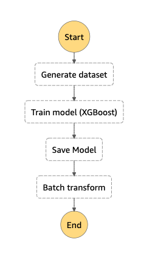

# Workshop Notes

Attendees of the SageMaker workshop asked some great questions. Here are some of those questions, some basic answers, and references to further reading material and documentation.

## Day 1

#### How can we find information on the versions of frameworks installed in the pre-built SageMaker images?

The best way to find this information is to look at the Dockerfiles and documentation of the specific images. For instance, here is information on official SageMaker [Sklearn Docker images](https://github.com/aws/sagemaker-python-sdk/tree/master/src/sagemaker/sklearn#sagemaker-scikit-learn-docker-containers).

#### Can we write custom logic to perform debugging during the training process?

Yes, here is how to write [custom Debugger Rules](https://github.com/awslabs/sagemaker-debugger/blob/master/docs/analysis.md#Writing-a-custom-rule).

#### How should you split data preprocessing from model inference?

One way of doing this is to separate preprocessing logic from model inference by [splitting scripts into inference pipelines](https://docs.aws.amazon.com/sagemaker/latest/dg/inference-pipelines.html).

#### How do you schedule SageMaker jobs?

SageMaker doesn't include a mechanism to schedule workflows. But you can easily use other AWS services in conjunction with SageMaker to add that functionality. One option is to schedule Jobs outside of notebooks with [AWS Step Functions](https://docs.aws.amazon.com/step-functions/latest/dg/welcome.html). AWS Step Functions is a web service that enables you to coordinate the components of distributed applications and microservices using visual workflows.

I found 2 samples in the Step Functions documentation:
* [Use Step Functions to kick off a SageMaker Training Job](https://docs.aws.amazon.com/step-functions/latest/dg/sample-train-model.html)
	* 
* [Use Step Functions to kick off a SageMaker Model Tuning Job](https://docs.aws.amazon.com/step-functions/latest/dg/sample-hyper-tuning.html)
    * 

## Day 2

#### Does AutoTune perform feature engineering or just automatic model selection?

> Amazon SageMaker Autopilot simplifies the machine learning experience by helping you explore your data and try different algorithms. It also automatically trains and tunes models on your behalf, to help you find the best algorithm. You simply upload tabular data in a file with comma-separated values (for example, from a spreadsheet or database), choose the target column to predict, and Autopilot builds a predictive model for you. These predictions can take the form of ordered numerical values (i.e., this is a regression model) or the form of categories (i.e., a classification model). Autopilot explores different combinations of data preprocessors, algorithms, and algorithm parameter settings to find an accurate model, similar to how a data scientist would, making it easier for novices to get started.

See [Use Amazon SageMaker Autopilot to Automate Model Development](https://docs.aws.amazon.com/sagemaker/latest/dg/autopilot-automate-model-development.html) for more details.

I was curious about how this worked so I ran an experiment on my own. Very cool stuff! Here is a breakdown of the new files:

* `notebooks/06_autotune.ipynb` - I created a notebook to upload some tabular data to S3 for the AutoTune job.
* `notebooks/06a_SageMakerAutopilotDataExplorationNotebook.ipynb` - Notebook auto-generated by SageMaker to perform data exploration.
* `notebooks/06b_SageMakerAutopilotCandidateDefinitionNotebook.ipynb` - Notebook auto-generated by SageMaker to perform model selection.
* `xgb-autotune-0417-0657-artifacts/` - Directory of artifacts created by AutoTune. These were downloaded from S3 and contain the Python scripts that AutoTune generates with feature preprocessing steps.

The `06b_SageMakerAutopilotCandidateDefinitionNotebook` notebook includes code to kick off a hyperparameter tuning job. Check out [How Hyperparameter Tuning Works](https://docs.aws.amazon.com/sagemaker/latest/dg/automatic-model-tuning-how-it-works.html) and see the [Best Practices for Hyperparameter Tuning](https://docs.aws.amazon.com/sagemaker/latest/dg/automatic-model-tuning-considerations.html).

#### Are there limits on the rate at which Batch Transform jobs can be started?

> Amazon SageMaker quotas for new accounts might be different from the default quotas listed here. If you receive an error that you've exceeded your quota, contact customer service to request a quota increase for the resources you want to use. On-demand and Spot instance quotas are tracked and modified separately. For example, with the default quotas, you could run up to 20 training jobs with on-demand ml.m4.xlarge instances and up to 20 training jobs with Managed Spot ml.m4.xlarge instances simultaneously. Request quota increases for on-demand and spot instances separately.

See the table titled **Amazon SageMaker Batch Transform** under the [Service Quotas](https://docs.aws.amazon.com/general/latest/gr/sagemaker.html#limits_sagemaker) section of the [Amazon SageMaker endpoints and quotas](https://docs.aws.amazon.com/general/latest/gr/sagemaker.html) page.

## Day 3

#### How can you connect SageMaker to GitHub repositories?

> Associate Git repositories with your notebook instance to save your notebooks in a source control environment that persists even if you stop or delete your notebook instance. You can associate one default repository and up to three additional repositories with a notebook instance. The repositories can be hosted in AWS CodeCommit, GitHub, or on any other Git server.

> There are two ways to associate a Git repository with a notebook instance: 1) Add a Git repository as a resource in your Amazon SageMaker account. Then, to access the repository, you can specify an AWS Secrets Manager secret that contains credentials. That way, you can access repositories that require authentication. 2) Associate a public Git repository that is not a resource in your account. If you do this, you cannot specify credentials to access the repository.

See [Associate Git Repositories with Amazon SageMaker Notebook Instances](https://docs.aws.amazon.com/sagemaker/latest/dg/nbi-git-repo.html) in the documentation.

#### How can we perform pre/post processing in SageMaker?

Check out [SageMaker Processing](https://sagemaker.readthedocs.io/en/stable/amazon_sagemaker_processing.html). SageMaker Processing allows you to run steps for data pre- or post-processing, feature engineering, data validation, or model evaluation workloads on Amazon SageMaker.

You can run a Scikit-Learn script to do data processing on SageMaker using the `SKLearnProcessor` class. [Here is an example](https://github.com/awslabs/amazon-sagemaker-examples/blob/master/sagemaker_processing/scikit_learn_data_processing_and_model_evaluation/scikit_learn_data_processing_and_model_evaluation.ipynb) where a preprocessing script takes one input from S3 and one command-line argument, processes the data, then splits the data into two datasets for output.

#### How can we use Spark with SageMaker?

[Here is the documentation](https://sagemaker.readthedocs.io/en/stable/sagemaker.sparkml.html) for the `sparkml` module in the Python SageMaker SDK. And [here](https://github.com/awslabs/amazon-sagemaker-examples/blob/master/sagemaker_processing/feature_transformation_with_sagemaker_processing/feature_transformation_with_sagemaker_processing.ipynb) is a sample notebook where Spark is used to  pre-process a dataset using SageMaker Processing. The example directory contains a [Dockerfile](https://github.com/awslabs/amazon-sagemaker-examples/blob/master/sagemaker_processing/feature_transformation_with_sagemaker_processing/container/Dockerfile) demonstrating how to install Hadoop and Spark.

