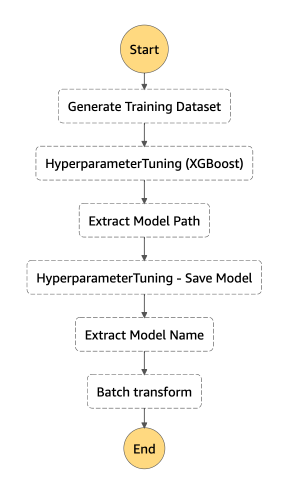

# Day 1

* Information on official [Sklearn Docker images](https://github.com/aws/sagemaker-python-sdk/tree/master/src/sagemaker/sklearn#sagemaker-scikit-learn-docker-containers)
* How to write [custom Debugger Rules](https://github.com/awslabs/sagemaker-debugger/blob/master/docs/analysis.md#Writing-a-custom-rule)
* Separating preprocessing logic from model inference by [splitting scripts into pipelines](https://docs.aws.amazon.com/sagemaker/latest/dg/inference-pipelines.html).
* Scheduling Jobs outside of notebooks with [AWS Step Functions](https://docs.aws.amazon.com/step-functions/latest/dg/welcome.html)
    * AWS Step Functions is a web service that enables you to coordinate the components of distributed applications and microservices using visual workflows.
    * Examples
        * [Kick off a SageMaker Training Job](https://docs.aws.amazon.com/step-functions/latest/dg/sample-train-model.html)
            * 
        * [Kick off a SageMaker Model Tuning Job](https://docs.aws.amazon.com/step-functions/latest/dg/sample-hyper-tuning.html)
            * 